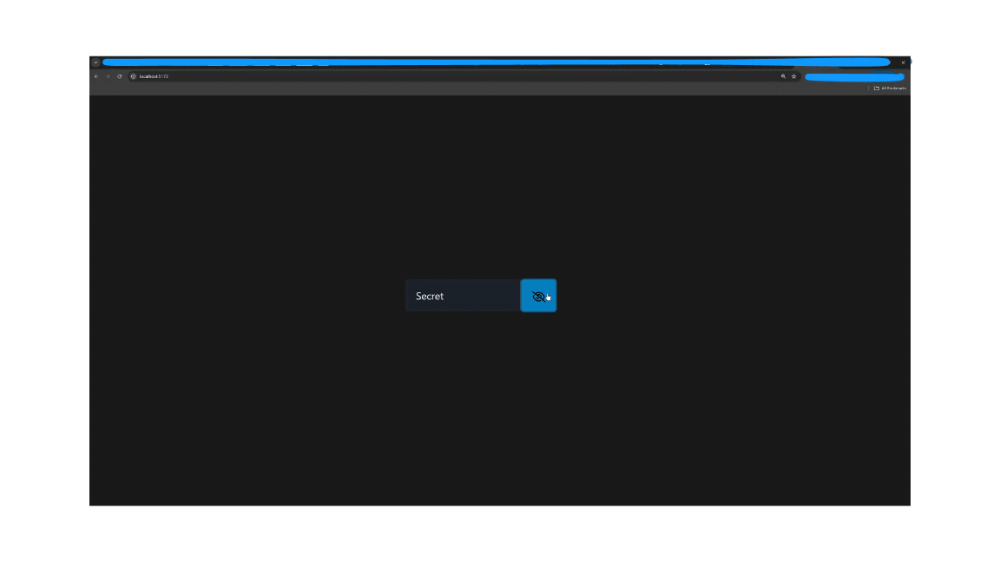

# vue-password-toggle

A simple lightweight component to show and hide the password input.

## Demo



## Setup

Business as usual by running

```sh
npm i vue-password-toggle 
```

and integrating it directly into your .vue file:

```js
<script>
  import { PasswordToggle } from 'vue-password-toggle'
  import 'vue-password-toggle/dist/style.css'
</script>
```

Current recommendation is [overwriting the default keyboard enter behaviour](https://v2.vuejs.org/v2/guide/events?#Key-Modifiers) by hand and use a [vue.js two way data binding](https://learnvue.co/articles/v-model-guide).

```js
<template>
  <PasswordToggle v-model:password="password" v-on:keydown.enter="doLogin($event)" />
</template>
```

Full working code example based on the vue.js generated template app included in the [repository](https://github.com/Dr4gon/vue-password-toggle).

```sh
npm i 
```

```sh
npm run dev
```

## Contributions

Any kind of requests, bugs, and so on and so forth, [write a ticket](https://github.com/Dr4gon/vue-password-toggle/issues/new).

## Status

- [x] Configure build process so dependency can be used
- [x] Write proper docu
- [ ] Clean out code
- [ ] Remove unused dependencies
- [ ] Add color options
- [ ] Set preventDefault behaviour as mandatory
- [ ] Have fun at riversurfing
- [ ] Fry super tasty rice with shrimps
- [ ] Save the world

### Credits

- If you made it this far in reading this doc, you deserve a laugh or two ;)
- Thank you for being, [Vue.js](https://vuejs.org/)!
- You make this look good, [Pico.css](https://picocss.com/) ^^
- My icons would look like crazy doodles from a 4 year old without [FontAwesome](https://fontawesome.com/)...
- The boring school system and games such as CS1.6, Warcraft III, Starcraft to inspire me to become a software engineer
- My Mom and Dad for bringing me into this world, and my imaginary girlfried for her love and support
- The Universe for creating such a wonderful planet

### License

Thank you for not reading [MIT](LICENSE)!
